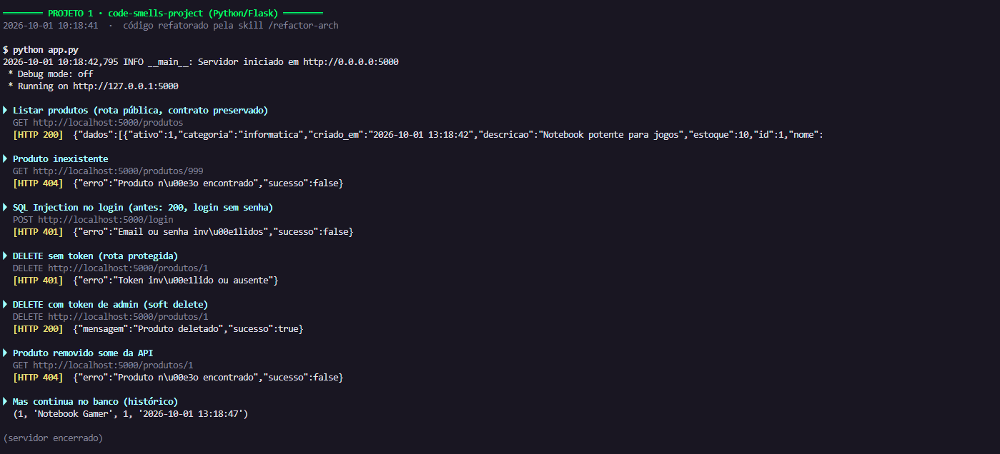
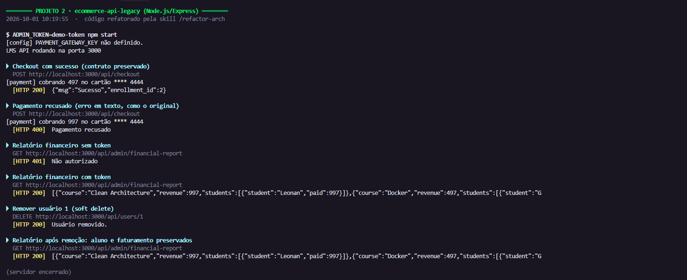
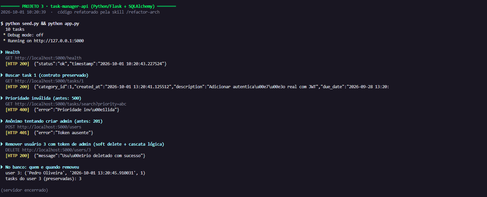

# Skill `refactor-arch`: Refatoração Arquitetural Automatizada

Entrega do desafio de **Skills** do MBA. O objetivo é criar uma skill do Claude Code que analisa, audita e refatora projetos legados para o padrão MVC, de forma agnóstica de tecnologia.

> Enunciado original: [devfullcycle/mba-ia-refactor-projects-skill](https://github.com/devfullcycle/mba-ia-refactor-projects-skill)

**Ferramenta:** Claude Code · **Projetos-alvo:** 2× Python/Flask + 1× Node.js/Express

---

## A) Análise Manual

### Metodologia

Cada projeto foi analisado em três passos:

1. **Leitura estrutural:** o que cada arquivo faz e onde as responsabilidades se misturam.
2. **Prova em execução:** os problemas de segurança foram reproduzidos com a aplicação rodando localmente (`curl`), para confirmar que são exploráveis de fato e não apenas teóricos.
3. **Conferência por busca (grep):** cada problema foi localizado por um *sinal de detecção* (ex.: "string SQL concatenada com `+`"), para garantir arquivo e linha exatos.

O passo 3 mostrou que a leitura visual **subestima** o problema: no Projeto 1, a primeira leitura apontou ~10 queries vulneráveis a SQL Injection, e a busca encontrou **19**. Também revelou **falsos positivos**: o sinal "query dentro de `for`" apontou linhas fora de loop. Essas duas lições orientaram o design da skill (buscar primeiro e confirmar lendo antes de reportar).

Severidades conforme a escala do desafio: **CRITICAL** (segurança/quebra total de separação) · **HIGH** (violação forte de MVC/SOLID) · **MEDIUM** (duplicação, performance, validação) · **LOW** (legibilidade, magic numbers).

### Projeto 1: `code-smells-project` (Python/Flask, API de E-commerce)

**Estrutura atual:** 4 arquivos (~780 linhas). Os nomes sugerem MVC (`models.py`, `controllers.py`), mas as responsabilidades estão misturadas: `app.py` executa SQL, `controllers.py` acessa o banco direto e `models.py` concentra o SQL de 4 domínios e ainda regra de negócio.

| # | Sev. | Problema | Local | Por que é relevante |
|---|---|---|---|---|
| 1 | CRITICAL | **SQL Injection:** queries montadas por concatenação de strings (19 ocorrências) | `models.py:28, 48, 58, 68, 92, 110, 127, 140, 149, 155, 158, 164, 174, 188, 192, 220, 224, 280, 291-297` | **Comprovado:** login como admin sem senha usando o e-mail `admin@loja.com' --`. O `--` comenta a verificação de senha. |
| 2 | CRITICAL | **Credencial hardcoded e vazada:** `SECRET_KEY` escrita no código e devolvida pelo `/health` | `app.py:7`, `controllers.py:289` | **Comprovado:** `GET /health` retorna a chave. Com ela é possível forjar sessões assinadas do Flask. |
| 3 | CRITICAL | **Senhas em texto puro e expostas na API** | `database.py:76-78`, `models.py:83, 99` | **Comprovado:** `GET /usuarios` lista as senhas de todos os usuários. Não há nenhum uso de hash no projeto. |
| 4 | CRITICAL | **Endpoints administrativos sem autenticação:** `/admin/query` executa SQL arbitrário e `/admin/reset-db` apaga o banco | `app.py:47-57, 59-78` | **Comprovado:** qualquer pessoa lê a tabela de usuários ou destrói todos os dados com um `POST`. |
| 5 | HIGH | **Regra de negócio fora da camada correta:** faixas de desconto dentro do acesso a dados; notificações (e-mail/SMS/push) simuladas com `print` no controller | `models.py:256-262`, `controllers.py:208-210, 248, 250` | Viola a separação de responsabilidades: a regra não pode ser testada nem alterada sem mexer em SQL ou em HTTP. |
| 6 | HIGH | **Estado global mutável:** uma conexão SQLite global compartilhada por todas as requisições, com `check_same_thread=False` | `database.py:4, 8, 10` | Acoplamento sem injeção de dependência. A flag apenas silencia a proteção de concorrência do SQLite. |
| 7 | MEDIUM | **Queries N+1:** uma query por pedido e mais uma por item | `models.py:187-199, 219-231` (listagens), `139-166` (`criar_pedido`) | 100 pedidos com 3 itens geram 401 queries, onde um `JOIN` resolveria com 1. |
| 8 | MEDIUM | **Duplicação:** validação de produto copiada entre criar/atualizar; montagem de pedido copiada; 16 blocos `except Exception` idênticos devolvendo `str(e)` | `controllers.py:30-34` vs `74-78`; `models.py:171-201` vs `203-233` | Toda correção precisa ser feita em vários lugares. `str(e)` vaza detalhes internos ao cliente. Falta error handler centralizado. |
| 9 | LOW | **Magic numbers e listas soltas:** limiares/percentuais de desconto, categorias e status válidos escritos inline | `models.py:257-262`, `controllers.py:52, 242` | Valores de negócio sem nome e sem ponto único de alteração. |
| 10 | LOW | **`print` no lugar de logging e debug fixo:** 19 `print` e `debug=True` sem controle por ambiente | `controllers.py` (14×), `app.py` (5×); `app.py:8, 88` | Sem níveis de log. Com `host="0.0.0.0"`, o console interativo do Werkzeug (que executa código Python) fica exposto na rede, protegido apenas por PIN. |

**Resumo:** CRITICAL 4 · HIGH 2 · MEDIUM 2 · LOW 2 (**10 problemas**)

### Projeto 2: `ecommerce-api-legacy` (Node.js/Express, LMS com checkout)

**Estrutura atual:** 3 arquivos (~180 linhas). `app.js` delega tudo a uma única classe, `AppManager`, que concentra conexão, schema, seed, rotas, regra de checkout, "gateway" de pagamento e relatório. `utils.js` mistura configuração com segredos, cache global e "criptografia". Não há separação de camadas. Diferente do Projeto 1, **não há SQL Injection**: todas as queries usam placeholders `?`.

| # | Sev. | Problema | Local | Por que é relevante |
|---|---|---|---|---|
| 1 | CRITICAL | **Credenciais hardcoded:** senha do banco e chave **live** do gateway de pagamento no código | `utils.js:2-5` | Qualquer pessoa com acesso ao repositório obtém credenciais de produção. |
| 2 | CRITICAL | **"Hash" de senha caseiro e quebrado:** `badCrypto` repete os 2 primeiros caracteres do base64 da senha; senha ausente vira `"123456"` | `utils.js:17-23`, `AppManager.js:68` | **Comprovado:** `senhaforte`, `se` e `sol` geram o mesmo hash `c2c2c2c2c2`. O resultado depende só dos ~12 primeiros bits da senha, e o base64 é reversível. |
| 3 | CRITICAL | **Dados sensíveis em log:** número completo do cartão e chave do gateway impressos no console | `AppManager.js:45` | **Comprovado:** o log mostra `Processando cartão 4111222233334444 na chave pk_live_...`. Viola PCI-DSS, e os logs costumam ir para ferramentas de terceiros. |
| 4 | CRITICAL | **God Class:** `AppManager` acumula conexão, DDL, seed, rotas HTTP, regra de negócio e integração de pagamento | `AppManager.js:4-139` | Separação de responsabilidades inexistente: nada pode ser testado ou substituído isoladamente. |
| 5 | HIGH | **Callback hell sem transação:** checkout com 6 níveis de callbacks aninhados; matrícula, pagamento e auditoria gravados sem `BEGIN/COMMIT` | `AppManager.js:37-77` | Se o insert do pagamento falhar, a matrícula já foi gravada: aluno matriculado sem pagar. Fluxo difícil de ler e de tratar erros. |
| 6 | HIGH | **Rotas sensíveis sem autenticação e exclusão sem integridade:** relatório financeiro aberto; `DELETE /users/:id` não trata matrículas e pagamentos | `AppManager.js:80, 131-137` | **Comprovado:** após o `DELETE`, o relatório passa a mostrar `"student":"Unknown"` com pagamento de 997. Dados órfãos e faturamento exposto publicamente. |
| 7 | HIGH | **Estado global mutável:** `globalCache` e `totalRevenue` em escopo de módulo e exportados | `utils.js:9-10, 25` | Estado compartilhado entre requisições, sem dono nem limite (vazamento de memória). `totalRevenue` é exportado como primitivo e nunca é atualizado (código morto). |
| 8 | MEDIUM | **Queries N+1** no relatório: por curso, uma query de matrículas; por matrícula, mais uma de usuário e uma de pagamento | `AppManager.js:89-127` | Crescimento O(cursos × matrículas) de queries, onde um único `JOIN` com `GROUP BY` resolveria. |
| 9 | MEDIUM | **Erros ignorados e sem tratamento centralizado:** `err` recebido e nunca checado; respostas de erro em texto puro espalhadas | `AppManager.js:57, 92, 104, 106, 133` | Se a query da linha 92 falhar, `enrollments` é `undefined` e `.length` derruba o processo. O `DELETE` responde sucesso mesmo em erro. |
| 10 | MEDIUM | **Validação de entrada ausente:** senha opcional, e-mail e cartão sem validação de formato | `AppManager.js:35, 68` | Usuários criados com senha padrão; dados inválidos chegam ao banco. |
| 11 | LOW | **Nomes crípticos:** variáveis `u, e, p, cid, cc` e campos abreviados no contrato (`usr`, `eml`, `pwd`) | `AppManager.js:29-33` | Leitura exige decifrar cada variável. |
| 12 | LOW | **Magic values / regra fake:** aprovação por `cc.startsWith("4")`, loop de `10000` iterações sem efeito, `self = this` misturado com arrow functions | `AppManager.js:26, 46`, `utils.js:19` | Regras sem nome nem explicação; o loop só consome CPU (gera sempre a mesma string). |

**Resumo:** CRITICAL 4 · HIGH 3 · MEDIUM 3 · LOW 2 (**12 problemas**)

### Projeto 3: `task-manager-api` (Python/Flask, Task Manager)

**Estrutura atual:** ~1.100 linhas divididas em `models/`, `routes/`, `services/` e `utils/`, com SQLAlchemy. A separação existe **só nas pastas**: os blueprints em `routes/` concentram validação, regra de negócio, acesso a dados e montagem da resposta (75 acessos a `db.session`/`Model.query` e 57 validações inline). Enquanto isso, `services/` e quase todo `utils/` **nunca são chamados**. A camada de controller não existe.

| # | Sev. | Problema | Local | Por que é relevante |
|---|---|---|---|---|
| 1 | CRITICAL | **Credenciais hardcoded:** `SECRET_KEY` e usuário/senha SMTP no código | `app.py:13`, `services/notification_service.py:9-10` | Segredos versionados no repositório. A senha SMTP dá acesso à conta de e-mail. |
| 2 | CRITICAL | **Senha com MD5 e hash exposto na API:** `to_dict()` inclui `password`, usado em login, listagem e criação | `models/user.py:21, 29, 32` | **Comprovado:** o login devolve `81dc9bdb52d04dc20036dbd8313ed055`, que é o `md5('1234')` disponível em qualquer rainbow table. MD5 sem salt é inadequado para senhas. |
| 3 | CRITICAL | **Ausência de autenticação e escalada de privilégio:** nenhuma rota protegida; `role` aceito do body; token "JWT" é uma string previsível | `routes/user_routes.py:52, 71, 120-122, 210` | **Comprovado:** um `POST /users` anônimo com `"role":"admin"` cria um administrador (201). O token `fake-jwt-token-1` é forjável trocando o número. |
| 4 | HIGH | **Rotas gordas, sem camada de controller/serviço:** validação, regra de negócio (atraso, estatísticas, produtividade) e queries dentro dos blueprints; CRUD de categorias dentro do blueprint de **relatórios** | `routes/task_routes.py` (24 acessos a dados / 24 validações), `routes/user_routes.py` (20/25), `routes/report_routes.py` (31/8, categorias em `157-223`) | As pastas sugerem camadas, mas a responsabilidade está toda na rota. Regras não podem ser testadas sem HTTP, e o blueprint de relatórios mistura dois domínios. |
| 5 | MEDIUM | **Queries N+1 e contagens repetidas:** `Model.query` dentro de loops e uma query `count()` por status/prioridade | `task_routes.py:41-57`, `report_routes.py:55-56, 161-163`, `user_routes.py:22`; 13× `filter_by(...).count()` em `report_routes.py:19-28`, `task_routes.py:276-279` | **Medido:** `GET /tasks` executa 17 queries para 10 tasks; `GET /reports/summary`, 20 queries. `joinedload` e `GROUP BY` resolveriam em 1-3. |
| 6 | MEDIUM | **Regra de negócio duplicada:** o cálculo de "atrasada" está copiado 6 vezes, embora `Task.is_overdue()` exista e nunca seja chamado; as listas de status/roles válidos aparecem 8 vezes | `task_routes.py:31, 72, 285`, `report_routes.py:35, 133`, `user_routes.py:172`; listas em `task_routes.py:110, 177`, `user_routes.py:71, 120`, `models/task.py:39`, `utils/helpers.py:75, 110-111` | Mudar a regra exige alterar 6 lugares; um esquecido gera respostas inconsistentes entre endpoints. |
| 7 | MEDIUM | **APIs deprecated:** `Model.query.get()` (legado no SQLAlchemy 2.0 → `db.session.get()`) e `datetime.utcnow()` (deprecated no Python 3.12+ → `datetime.now(timezone.utc)`) | 16× `.query.get(` em `routes/`; 22× `utcnow` (ex.: `models/task.py:15-16, 52`, `task_routes.py:31`) | **Comprovado:** a execução emite `LegacyAPIWarning` e `DeprecationWarning`. `utcnow()` está agendado para remoção e vai quebrar numa versão futura do Python. |
| 8 | MEDIUM | **Validação frágil e tratamento de erro ausente:** tipos não checados, 13 `except:` sem tipo e nenhum error handler central | `task_routes.py:113, 261`; `except:` em `task_routes.py:62, 137, 204, 236`, `user_routes.py:130, 149`, `report_routes.py:186, 207, 221`, `helpers.py:46, 49, 88` | **Comprovado:** `priority="5"` (string) e `?priority=abc` derrubam a requisição com **500**. O `except:` sem tipo engole até `KeyboardInterrupt` e esconde a causa. |
| 9 | LOW | **Código morto:** `NotificationService`, 11 funções/constantes de `utils/helpers.py` e `Task.validate_status/validate_priority` nunca são chamados | `services/notification_service.py:4`, `utils/helpers.py:9-116`, `models/task.py:38-48` | Dá a falsa impressão de que existe camada de serviço e validação centralizada. A lógica "morta" já diverge da usada (ex.: `parse_date` aceita `dd/mm/aaaa`, as rotas não). |
| 10 | LOW | **Imports não usados:** 19 imports sem uso (`os`, `sys`, `json`, `time`, `math`, `hashlib`...) | `app.py:7`, `routes/task_routes.py:7`, `routes/user_routes.py:6`, `routes/report_routes.py:7-8`, `utils/helpers.py:2-7`, `models/task.py:3` | Ruído, e sugere dependências que não existem. |
| 11 | LOW | **Verbosidade e config fixa:** `if cond: return True else: return False`, `type(x) == list`, `print` como log, `debug=True` fixo | `models/user.py:35-38`, `models/task.py:40-60`, `task_routes.py:141`, `app.py:34` | Legibilidade; debug sem controle por ambiente. |

**Resumo:** CRITICAL 3 · HIGH 1 · MEDIUM 4 · LOW 3 (**11 problemas**)

---

## B) Construção da Skill

### Estrutura

```
.claude/skills/refactor-arch/
├── SKILL.md                         # orquestra as 3 fases, regras invioláveis e portões
└── references/
    ├── project-analysis.md          # Fase 1: heurísticas de linguagem, framework, banco, endpoints e arquitetura
    ├── anti-patterns-catalog.md     # Fase 2: 14 anti-patterns com sinais, "como confirmar" e severidade
    ├── audit-report-template.md     # Fase 2: formato do relatório e pergunta de confirmação
    ├── mvc-guidelines.md            # Fases 2/3: camadas, direção das dependências, estrutura alvo por stack
    └── refactoring-playbook.md      # Fase 3: 14 transformações com código antes/depois (Python e Node)
```

| Área exigida | Arquivo |
|---|---|
| Análise de projeto | `project-analysis.md` |
| Catálogo de anti-patterns | `anti-patterns-catalog.md` |
| Template de relatório | `audit-report-template.md` |
| Guidelines de arquitetura | `mvc-guidelines.md` |
| Playbook de refatoração | `refactoring-playbook.md` |

### Decisões de design

1. **SKILL.md como orquestrador, conhecimento nas referências (progressive disclosure).** O `SKILL.md` (~160 linhas) define o fluxo e indica **qual referência ler em cada fase**. As ~1.900 linhas de conhecimento só entram no contexto quando a fase chega.
2. **`disable-model-invocation: true`.** Uma skill que reescreve o projeto inteiro só pode rodar quando alguém digita `/refactor-arch`, nunca por gatilho automático. O `quick_validate.py` do skill-creator acusa esse campo porque segue o padrão genérico de Agent Skills; o campo é específico do Claude Code.
3. **Regras invioláveis no topo:** nada é modificado antes do "y" (nem rodar o app, que criaria o `.db`); buscar → ler → reportar; contrato da API preservado; convenções do projeto preservadas; honestidade (nunca marcar ✓ sem verificar); não alterar o estado do git; nunca apagar histórico de negócio.
4. **Baseline e validação automáticos.** A Fase 3 sobe a aplicação **antes** de alterar qualquer coisa, chama todos os endpoints do inventário e registra status e chaves. Depois da refatoração, repete a mesma preparação e compara. Há até 5 ciclos de correção; se não passar, a skill reporta a falha em vez de declarar sucesso.
5. **Relatório salvo dentro do projeto** (`reports/audit-report.md`), para a skill continuar agnóstica. A cópia para `reports/audit-project-N.md` na raiz é um passo manual da entrega.
6. **Exemplos do playbook testados antes de entrar na skill.** O teste pegou bugs que a skill copiaria para os 3 projetos: um `errorhandler(Exception)` do Flask que transformava 405 em 500; um handler do Express que transformava JSON malformado (400) em 500; e a troca direta de `utcnow()` por `now(timezone.utc)`, que gera `TypeError` ao comparar com datas *naive* do SQLite.

### Anti-patterns do catálogo e por quê

Os 14 itens saíram da análise manual (seção A): cada problema encontrado virou uma entrada, e cada entrada aparece em pelo menos um projeto.

| ID | Anti-pattern | Severidade | Princípio | Onde aparece |
|---|---|---|---|---|
| AP-01 | SQL Injection | CRITICAL | OWASP A03 | P1 (19 queries) |
| AP-02 | Credenciais hardcoded | CRITICAL | OWASP A07 / 12-Factor | P1, P2, P3 |
| AP-03 | Armazenamento inseguro de senha | CRITICAL | OWASP A02 | P1, P2, P3 |
| AP-04 | Exposição de dados sensíveis | CRITICAL | OWASP A01/A09 | P1, P2, P3 |
| AP-05 | Endpoint sensível sem autenticação | CRITICAL | OWASP A01 | P1, P2, P3 |
| AP-06 | God Class / God File | CRITICAL | SRP + MVC | P1, P2, P3 |
| AP-07 | Regra de negócio na camada errada | HIGH | SRP + MVC | P1, P2, P3 |
| AP-08 | Estado global mutável / sem DI | HIGH | DIP | P1, P2 |
| AP-09 | Multi-etapa sem transação / exclusão física de histórico | HIGH | ACID | P1, P2, P3 |
| AP-10 | Query N+1 | MEDIUM | Performance | P1, P2, P3 |
| AP-11 | Código duplicado | MEDIUM | DRY | P1, P2, P3 |
| AP-12 | Erro engolido / sem handler / validação ausente | MEDIUM | Robustez | P1, P2, P3 |
| AP-13 | **API deprecated** (tabela com equivalente moderno) | MEDIUM | Manutenibilidade | P3 (`utcnow`, `Query.get`) |
| AP-14 | Magic numbers, nomes, código morto, logging | LOW | Clean Code | P1, P2, P3 |

Cada entrada tem: **sinais de detecção** (com regex testada nos 3 projetos), **"como confirmar"** (quando **não** é finding), exemplo e link para o padrão do playbook. O "como confirmar" nasceu dos falsos positivos da análise manual: SQL com placeholder não é injection, callback do `sqlite3` é estilo antigo mas não deprecated, `minipass` no lockfile não é senha, `IN` com marcadores gerados é parametrizado.

### Como a skill é agnóstica de tecnologia

- **Sinais em Python e JavaScript** em cada anti-pattern, mais uma tabela de API deprecated para cada ecossistema (Python/Flask/SQLAlchemy e Node/Express).
- **Estrutura alvo por stack** (`mvc-guidelines.md` §4): pacotes na raiz no Flask (mantém `python app.py` e o `seed.py`) e tudo em `src/` no Express (mantém `npm start`, CommonJS).
- **Estratégia por nível de organização** (§6): **A) monolito** → decomposição completa (P1, P2); **B) parcialmente em camadas** → evolução, mantendo o que está certo (P3 manteve `routes/` e os models e criou `controllers/`); **C) adequado** → só correções de código.
- **Preservação de convenções:** idioma dos nomes (P1 em português, P2/P3 em inglês, incluindo a coluna de soft delete `removido` × `deleted`), formato de resposta (JSON no P1/P3, **texto puro** nos erros do P2) e comandos de execução.
- **Prova:** a mesma skill, sem nenhuma alteração entre projetos, rodou nas duas stacks. Não reportou SQL Injection no P2 (que usa placeholders) e reportou APIs deprecated só no P3, onde elas existem.

### Desafios encontrados: iterações

| # | Execução | O que aconteceu | Ajuste na skill | Evidência |
|---|---|---|---|---|
| 1 | P1 v1 | O Refactoring Plan da Fase 2 propôs Blueprints dentro de `controllers/`, `config.py` e `errors.py`, fora da estrutura MVC definida. **Causa:** as guidelines MVC só eram lidas na Fase 3, mas o plano é montado na Fase 2 | A Fase 2 passa a ler `mvc-guidelines.md` §4/§6 antes do plano; views e controllers separados explicitamente | `reports/iteracoes/audit-project-1-v1.md` |
| 2 | P1 v2 | Validação independente encontrou um falso positivo do grep de SQL Injection num `IN (?, ?, ?)` com marcadores gerados | Catálogo AP-01: `IN` com marcadores gerados não é finding | `reports/iteracoes/*-project-1-v2.md` |
| 3 | P2 v1 | (a) A skill usou `git rm` (a regra só proibia commit/push). (b) Para eliminar dados órfãos, apagou em cascata matrículas e **pagamentos**, e o faturamento do relatório caiu. **Revisão humana:** nunca apagar histórico de negócio | Regra 6: nenhum comando git que altere estado. Regra 7 + PT-09: **soft delete** (coluna `removido`/`deleted`, leituras de negócio filtram, relatórios não, migração idempotente). AP-09: exclusão física de entidade com histórico vira finding | `reports/iteracoes/*-project-2-v1.md`, `reports/logs/session-project-2-v1.txt` |
| 4 | P1 v3 | A skill ampliou a autenticação para 8 rotas (variação entre execuções em decisões de escopo). **Revisão humana na pausa:** proteger só rotas administrativas, destrutivas e financeiras | Nenhum: ajuste feito na resposta ao `[y/n]`, como previsto no template | `reports/logs/session-project-1.txt` |
| 5 | P2 v2 | A skill tornou `pwd` obrigatório no checkout (quebra de contrato). **Revisão humana:** manter opcional, com senha aleatória e hash | Nenhum: ajuste na resposta ao `[y/n]` | `reports/logs/session-project-2.txt` |
| 6 | Pós P2 v2 | Revisão humana: o soft delete grava **quando** removeu, mas não **quem** | PT-09 regra 8: gravar `removido_por`/`deleted_by` com usuário autenticado; sem identidade, registrar em `audit_logs` ou log | Aplicada no P3 (`deleted_by`) |
| 7 | P3 | Nenhum ajuste necessário: plano, soft delete com `deleted_by`, estratégia B e escopo de autenticação corretos de primeira | n/a | `reports/logs/session-project-3.txt` |

**Principal aprendizado:** a skill resolve bem os problemas técnicos (segurança, camadas, performance), mas **decisões de negócio e de escopo de contrato** (apagar ou preservar histórico, quais rotas exigir autenticação) variam entre execuções. A pausa obrigatória da Fase 2 é o ponto em que o humano calibra essas decisões, e cada calibração recorrente vira regra na skill. A quantidade de ajustes caiu a cada projeto (P1: 3 execuções; P2: 2; P3: 1, sem ajuste).

### Melhorias em aberto

- **"Quem removeu" nos Projetos 1 e 2:** a regra 8 (registrar quem fez o soft delete) foi incluída na skill **depois** das execuções finais de P1 e P2. Esses dois projetos gravam apenas **quando** removeu (`removido_em`/`deleted_at`). Não foram reexecutados por limite de tempo e de tokens de execução. A regra vale a partir do Projeto 3; aplicar em P1/P2 exige só uma nova execução de `/refactor-arch`.
- **Autenticação das rotas de leitura:** por decisão de escopo (não quebrar clientes atuais), listagens que expõem nome/e-mail (`GET /usuarios`, `/users`, `/reports/*`) continuam públicas. Está registrado como recomendação no "Out of scope" de cada relatório.
- **Formato de 404/405 no P3:** respostas de rota inexistente/método não permitido passaram de HTML para JSON `{"error": ...}` (mesmo status). A mudança é inofensiva, mas não foi listada no relatório; no P1 a skill preservou o HTML.

---

## C) Resultados

### Resumo das auditorias (Fase 2)

| Projeto | Stack | CRITICAL | HIGH | MEDIUM | LOW | Total | Resolvidos na Fase 3 |
|---|---|---|---|---|---|---|---|
| P1: `code-smells-project` | Python + Flask 3.1.1 | 6 | 3 | 3 | 3 | **15** | 13 + 2 parciais¹ |
| P2: `ecommerce-api-legacy` | Node 22 + Express 4.22 | 5 | 4 | 3 | 4 | **16** | 15 + 1 parcial² |
| P3: `task-manager-api` | Python + Flask 3.0.0 + SQLAlchemy 2.1 | 5 | 2 | 4 | 3 | **14** | 14 |

¹ F-05: autenticação restrita às rotas administrativas, destrutivas e financeiras por decisão humana. F-11: divergência de validação entre POST e PUT `/produtos` mantida para não mudar o contrato.
² F-12: validação de formato de e-mail/cartão não incluída (mudaria quais payloads o checkout aceita).

Relatórios completos: [`reports/audit-project-1.md`](reports/audit-project-1.md), [`reports/audit-project-2.md`](reports/audit-project-2.md), [`reports/audit-project-3.md`](reports/audit-project-3.md). Resumos da Fase 3 (com tabela de endpoints antes/depois): `<projeto>/reports/refactor-summary.md`.

**Cobertura da análise manual:** os relatórios da skill contêm 10/10 problemas do P1, 12/12 do P2 e 11/11 do P3, além de achados novos (ex.: transação ausente no pedido do P1, usuário "fantasma" criado antes do pagamento no P2, ordem não determinística do relatório no P2).

### Antes × depois

**P1: `code-smells-project` (estratégia A: decomposição completa)**
```
ANTES: 4 arquivos, 780 linhas            DEPOIS: 30 arquivos, 938 linhas
app.py          config + rotas + SQL     app.py         create_app() (composition root)
controllers.py  HTTP + SQL + notificação config/        settings do ambiente
models.py       SQL de 4 domínios        models/        produto, usuario, pedido, relatorio
database.py     conexão global           views/         6 Blueprints (só delegam)
                                         controllers/   6 controllers
                                         services/      notificação
                                         middlewares/   error_handler, auth
                                         utils/         constantes
                                         database.py    conexão por requisição, migração, seed
```

**P2: `ecommerce-api-legacy` (estratégia A: decomposição completa)**
```
ANTES: 3 arquivos, 180 linhas            DEPOIS: 18 arquivos, 417 linhas
src/app.js         entry                 src/app.js        composition root
src/AppManager.js  God Class             src/config/       ambiente
src/utils.js       config + cache + hash src/database/     conexão promisificada + transaction(), schema
                                         src/models/       user, course, enrollment, payment, auditLog, report
                                         src/controllers/  checkout, report, user
                                         src/routes/       Router (View)
                                         src/services/     paymentService
                                         src/middlewares/  errorHandler, auth
                                         src/utils/        password (scrypt)
```

**P3: `task-manager-api` (estratégia B: evolução incremental)**
```
ANTES: 15 arquivos, 1.158 linhas         DEPOIS: 30 arquivos, 1.164 linhas
app.py        config + rotas + boot      app.py        create_app() (seed.py continua importando app, db)
models/       ORM (mantidos)             models/       mantidos + is_overdue reutilizado + soft_delete
routes/       rotas "gordas"             routes/       Blueprints só delegam (+ category_routes, health_routes)
services/     código morto               controllers/  NOVO: task, user, category, report, health, validators
utils/        quase tudo sem uso         config/       NOVO · middlewares/ NOVO (error_handler, auth)
                                         utils/        constants, time (utc_now), helpers enxuto
                                         services/     removido (código morto com senha SMTP hardcoded)
```

### Checklist de validação

| Item | P1 | P2 | P3 |
|---|---|---|---|
| **Fase 1: Análise** | | | |
| Linguagem detectada corretamente | ✅ Python 3.14 | ✅ JavaScript / Node 22 | ✅ Python 3.14 |
| Framework detectado corretamente | ✅ Flask 3.1.1 | ✅ Express ^4.18.2 (4.22.1 instalado) | ✅ Flask 3.0.0 + SQLAlchemy |
| Domínio descrito corretamente | ✅ E-commerce | ✅ LMS com checkout | ✅ Task Manager |
| Nº de arquivos condiz com a realidade | ✅ 4 | ✅ 3 | ✅ 15 (inclui seed) |
| **Fase 2: Auditoria** | | | |
| Relatório segue o template | ✅ | ✅ | ✅ |
| Cada finding com arquivo e linhas exatos | ✅ | ✅ | ✅ |
| Ordenado CRITICAL → LOW | ✅ | ✅ | ✅ |
| Mínimo de 5 findings | ✅ 15 | ✅ 16 | ✅ 14 |
| APIs deprecated (se aplicável) | ✅ nenhuma (busca documentada) | ✅ nenhuma (callbacks ≠ deprecated) | ✅ 23× `utcnow`, 16× `Query.get` |
| Pausa e pede confirmação | ✅ | ✅ | ✅ |
| **Fase 3: Refatoração** | | | |
| Estrutura segue MVC | ✅ | ✅ | ✅ (`routes/` = views) |
| Config extraída (sem hardcoded) | ✅ `config/settings.py` | ✅ `src/config/` | ✅ `config/settings.py` |
| Models abstraem dados | ✅ | ✅ | ✅ |
| Views/Routes separadas | ✅ `views/` | ✅ `src/routes/` | ✅ `routes/` |
| Controllers concentram o fluxo | ✅ | ✅ | ✅ |
| Error handling centralizado | ✅ | ✅ | ✅ |
| Entry point claro | ✅ `create_app()` | ✅ composition root | ✅ `create_app()` |
| Aplicação inicia sem erros | ✅ | ✅ | ✅ |
| Endpoints originais respondem | ✅ | ✅ | ✅ |

### Validação independente (além da validação da própria skill)

Para não depender só do resumo gerado pela skill, cada projeto foi validado por um script independente que roda os mesmos cenários contra o **código original** (extraído do commit inicial) e contra o **refatorado**, comparando status HTTP e estrutura das respostas campo a campo.

| | P1 | P2 | P3 |
|---|---|---|---|
| Cenários comparados | 28 | 16 | 36 |
| Divergências **não aprovadas** | **0** | **0** | **0** |
| SQL Injection no login (`' --`) | 200 → **401** | n/a (sem SQLi) | n/a |
| Cartão no log do servidor | n/a | 1× → **0×** | n/a |
| Senha no banco | texto puro → scrypt | base64 caseiro → scrypt | MD5 → scrypt |
| Warnings de deprecation do projeto | 0 → 0 | 0 → 0 | **22 → 0** |
| Soft delete: registro continua no banco | ✅ (produto) | ✅ (usuário) | ✅ (task, user + tasks, category) |
| Histórico preservado após exclusão | pedido antigo mostra o nome do produto (antes: `"Desconhecido"`) | relatório mantém aluno e faturamento (antes: `"Unknown"`) | relatório mantém o usuário; `deleted_by` gravado |

### Screenshots: aplicações rodando após a refatoração

Cada print mostra o boot da aplicação refatorada e chamadas reais com `curl`: endpoint preservado, erro tratado, rota protegida sem/com token e a prova do soft delete no banco.

**Projeto 1: code-smells-project (Python/Flask)**: SQL Injection barrada (401), `DELETE` protegido e produto removido que some da API mas continua no banco.



**Projeto 2: ecommerce-api-legacy (Node.js/Express)**: checkout preservado, cartão mascarado no log, relatório protegido e faturamento mantido após remover o aluno.



**Projeto 3: task-manager-api (Python/Flask + SQLAlchemy)**: seed + boot, validação 400 (antes 500), escalada de privilégio bloqueada e soft delete com `deleted_by`.



### Logs da aplicação rodando após a refatoração

Os logs completos das sessões (Fases 1-3, incluindo as chamadas de validação) estão em [`reports/logs/`](reports/logs/). Trechos das validações:

```
# P1: python app.py
INFO __main__: Servidor iniciado em http://0.0.0.0:5000
 * Debug mode: off
GET    /produtos/999                     → {"erro":"Produto não encontrado","sucesso":false}  [404]
POST   /login (admin@loja.com' --)       → {"erro":"Email ou senha inválidos","sucesso":false}  [401]   (antes: 200)
DELETE /produtos/1 (sem token)           → [401]
DELETE /produtos/1 (Bearer token admin)  → {"mensagem":"Produto deletado","sucesso":true}  [200]   (soft delete)

# P2: node src/app.js
POST /api/checkout         → {"msg":"Sucesso","enrollment_id":2}  [200]
GET  /api/admin/financial-report (sem token)  → Não autorizado  [401]
GET  /api/admin/financial-report (Bearer)     → [{"course":"Clean Architecture","revenue":997,...}]  [200]

# P3: python seed.py && python app.py
 * Debug mode: off
GET /health → {"status":"ok","timestamp":"2026-10-01 09:57:07"}  [200]
DELETE /users/3 (admin) → 200; tarefas do usuário somem da API; users.deleted_by = 1
```

### Observações sobre stacks diferentes

- **Python monolito (P1) × Node monolito (P2):** a mesma estratégia A gerou estruturas equivalentes, respeitando o idioma de cada uma: Blueprints × Router, `flask.g` × conexão injetada, `werkzeug.security` × `crypto.scrypt`, `with db:` × `transaction()` com `BEGIN/COMMIT`.
- **Projeto já organizado (P3):** a skill não "reescreveu por reescrever". Manteve `routes/` e os models, criou só a camada que faltava (`controllers/`) e justificou o único desvio de nomenclatura (`models/task.py` mantido porque o `seed.py` importa esse caminho).
- **Contrato preservado mesmo em detalhes:** o P2 continua respondendo erros em texto puro; o P1 manteve os 404/405 em HTML do Flask.
- **Variação entre execuções:** severidade (ex.: `report_routes.py` como God File CRITICAL no P3) e escopo de autenticação variaram de uma rodada para outra. A pausa da Fase 2 foi decisiva para calibrar isso (ver iterações 4 e 5).

---

## D) Como Executar

### Pré-requisitos

- [Claude Code](https://docs.anthropic.com/en/docs/claude-code/overview) instalado e autenticado (`claude --version`)
- Python 3.10+ (testado com 3.14) e Node.js 18+ (testado com 22)
- Git

### Preparar os projetos

```bash
git clone https://github.com/viniciusventura/mba-ia-refactor-projects-skill.git
cd mba-ia-refactor-projects-skill

# Projeto 1 e 3 (Python)
cd code-smells-project && python -m venv .venv && .venv/Scripts/pip install -r requirements.txt && cd ..   # Linux/macOS: .venv/bin/pip
cd task-manager-api   && python -m venv .venv && .venv/Scripts/pip install -r requirements.txt && cd ..

# Projeto 2 (Node)
cd ecommerce-api-legacy && npm install && cd ..
```

### Executar a skill

A skill fica em `.claude/skills/refactor-arch/` dentro de cada projeto (as 3 cópias são idênticas). Rode **dentro** da pasta do projeto, numa sessão nova do Claude Code:

```bash
cd code-smells-project   && claude "/refactor-arch"
cd ../ecommerce-api-legacy && claude "/refactor-arch"
cd ../task-manager-api   && claude "/refactor-arch"
```

Fluxo:
1. **Fase 1** imprime `PHASE 1: PROJECT ANALYSIS` e o inventário de endpoints.
2. **Fase 2** salva `reports/audit-report.md` e pergunta `Proceed with refactoring (Phase 3)? [y/n]`. Revise principalmente o **Refactoring Plan** e as **mudanças de contrato**. Responda `y`, `n`, ou `y, mas ...` com ajustes.
3. **Fase 3** captura o baseline, refatora, valida e salva `reports/refactor-summary.md`.
4. Opcional: `/export` salva o log da sessão.

> Os projetos deste repositório **já estão refatorados**. Para reproduzir do zero, use uma cópia do código original (commit `6d1ce62`, por exemplo com `git worktree add ../original 6d1ce62`) e copie para dentro dela a pasta `.claude/` de qualquer projeto deste repositório.

### Validar a refatoração

**P1: code-smells-project**
```bash
cd code-smells-project
python app.py                                         # http://localhost:5000 (variáveis opcionais em .env.example)
curl http://localhost:5000/produtos                   # 200
curl -X POST localhost:5000/login -H "Content-Type: application/json" -d '{"email":"admin@loja.com","senha":"admin123"}'   # 200 + token
curl -X DELETE localhost:5000/produtos/1              # 401 sem token
curl -X DELETE localhost:5000/produtos/1 -H "Authorization: Bearer <token>"   # 200 (soft delete)
```

**P2: ecommerce-api-legacy**
```bash
cd ecommerce-api-legacy
ADMIN_TOKEN=meu-token npm start                       # http://localhost:3000
# api.http: defina @adminToken = meu-token e execute as requisições (VS Code + REST Client)
```

**P3: task-manager-api**
```bash
cd task-manager-api
python seed.py && python app.py                       # http://localhost:5000
curl http://localhost:5000/tasks                      # 200
curl -X POST localhost:5000/login -H "Content-Type: application/json" -d '{"email":"joao@email.com","password":"1234"}'   # 200 + token
```

O que conferir: a aplicação sobe sem erro; os endpoints originais respondem com o mesmo status do original (exceto as mudanças de contrato listadas em cada `refactor-summary.md`); a tabela **Endpoint Comparison** de cada `refactor-summary.md` mostra baseline × depois.

### Estrutura de entrega

```
reports/
├── audit-project-{1,2,3}.md      # saída da Fase 2 (versão final de cada projeto)
├── iteracoes/                    # relatórios de execuções anteriores (evidência das iterações)
├── logs/                         # /export das sessões do Claude Code
└── screenshots/                  # aplicações rodando após a refatoração
```
